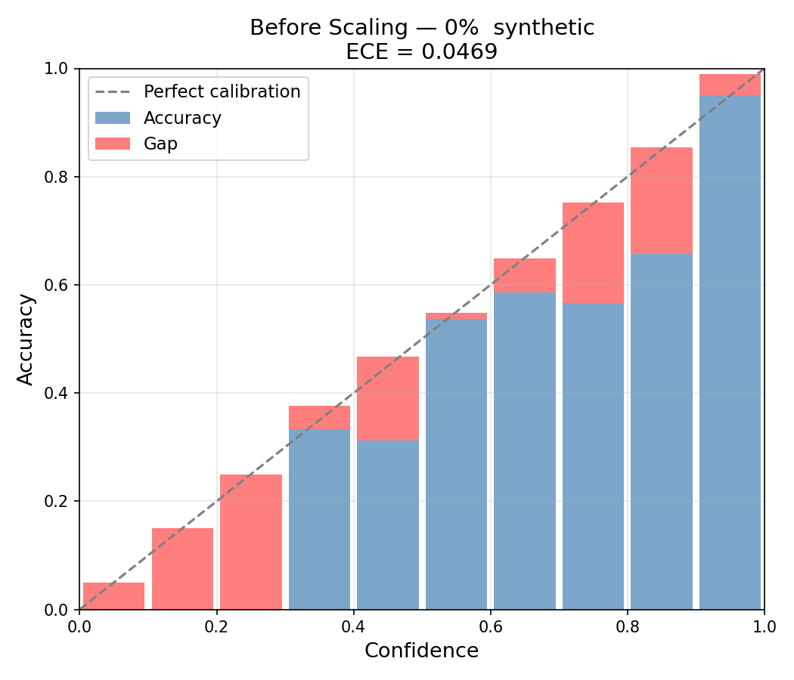
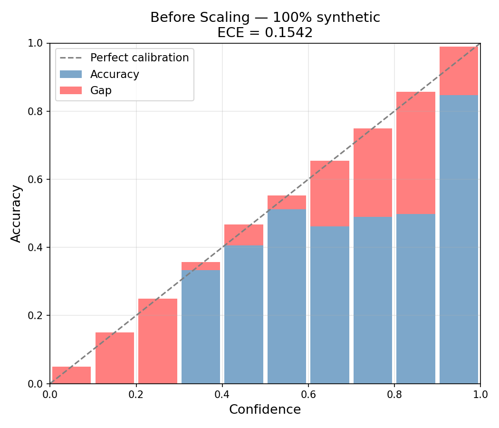
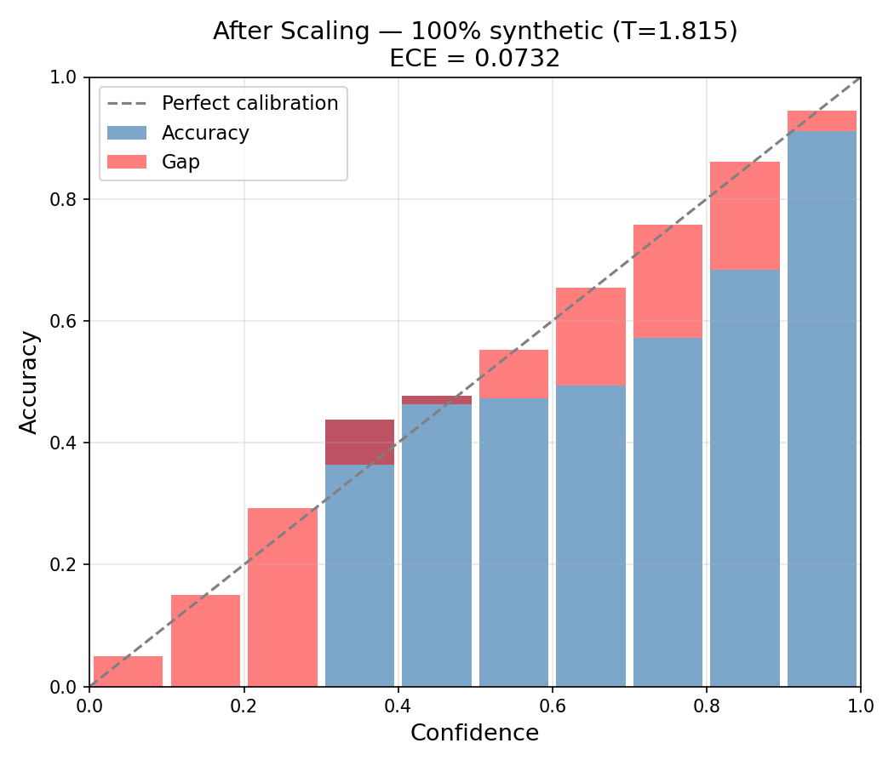
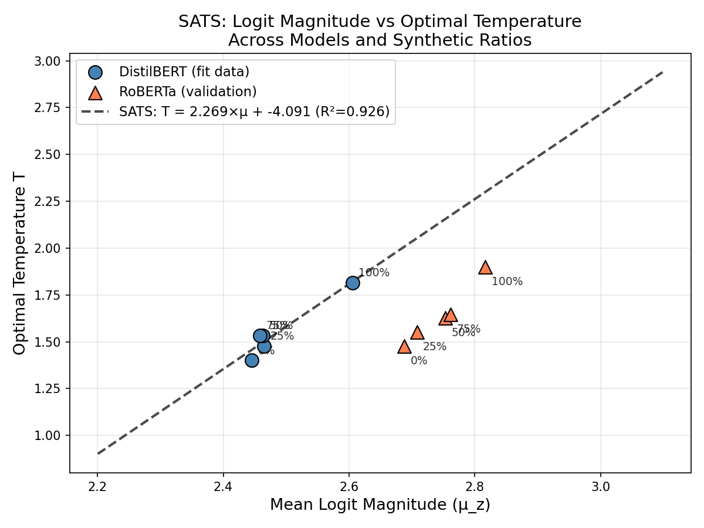

<div align="center">
  <h1>📉 Calibration Collapse</h1>
  <p><b>Diagnosing and Correcting Synthetic-Induced Overconfidence in Transformer Classifiers</b></p>
</div>

> **Disclaimer:** This repository, the code, and the accompanying synthetic datasets are intended strictly for **academic and research purposes**.

## 📖 Overview
Large Language Models (LLMs) are increasingly used to generate synthetic training data to reduce annotation costs. However, this introduces a critical but underexplored hidden failure mechanism: classifiers trained on synthetic data become systematically overconfident, producing highly certain predictions that are often incorrect. 

This repository provides the code, datasets, and experiments for diagnosing this phenomenon—which we term **Calibration Collapse**—and introduces **Synthetic-Aware Temperature Scaling (SATS)**, a heuristic method to correct it without requiring a human-labeled validation set.

## 📊 The Phenomenon: Calibration Collapse
As the proportion of synthetic data increases, models learn to inflate logit magnitudes rather than robust decision boundaries, largely due to the lack of long-tail linguistic diversity in LLM-generated text. This destroys probabilistic calibration.

### Reliability Diagrams (DistilBERT)
*Ideal calibration follows the diagonal line. Predictions below the line indicate overconfidence.*

| 0% Synthetic (Real Baseline) | 100% Synthetic (Uncalibrated) | 100% Synthetic (Post-Scaling) |
|:---:|:---:|:---:|
|  |  |  |
| **ECE: 4.96%** | **ECE: 17.10%** | **ECE: 8.42%** |

### Key Findings (DistilBERT)

| Synthetic Ratio | Accuracy | Uncalibrated ECE | Global Temp ($T$) | Post-Scaling ECE |
|:---:|:---:|:---:|:---:|:---:|
| 0% (Real) | 91.9% | 4.96% | 1.43 | 2.04% |
| 25% | 91.4% | 5.31% | 1.46 | 2.01% |
| 50% | 90.7% | 6.00% | 1.49 | 2.08% |
| 75% | 89.7% | 6.82% | 1.54 | **1.80%** |
| 100% | 78.4% | **17.10%** | 1.86 | 8.42% |

*Notice the massive spike in overconfidence at 100% synthetic training. While Temperature Scaling improves calibration beautifully in mixed regimes (achieving an excellent 1.80% ECE at a 75% synthetic mix), a residual 8.42% error persists at the 100% extreme. This proves that fully synthetic regimes inflict irreversible structural damage to the logit space.*

## 🚀 Synthetic-Aware Temperature Scaling (SATS)
We propose SATS to achieve validation-free calibration. By mathematically modeling the linear logit inflation caused by synthetic data variance reduction, SATS predicts the optimal Temperature Scaling parameter ($T$) directly from unscaled test-time logit statistics. 

<div align="center">
  
</div>

## 📂 Repository Structure
- `src/`: Core Python modules for training, calibration (`sats.py`), and experiment execution.
- `data/`: Mixed real and synthetic (LLaMA 3.2 / Gemma 2) training samples.
- `results/`: Output logs, CSV metrics, and generated reliability diagrams.
- `test.py`: Entry point for executing the pipeline.

## ⚙️ Setup and Usage
1. Clone the repository and install dependencies:
   ```bash
   pip install -r requirements.txt
   ```
2. Run the main evaluation suite:
   ```bash
   python test.py
   ```

## 📜 License & Acknowledgements
- The codebase is released under the **MIT License**.
- Synthetic datasets were generated using LLaMA 3.2 and Gemma 2. Their usage is subject to the respective Meta and Google Acceptable Use Policies. 
- *Intended for academic research purposes only.*
